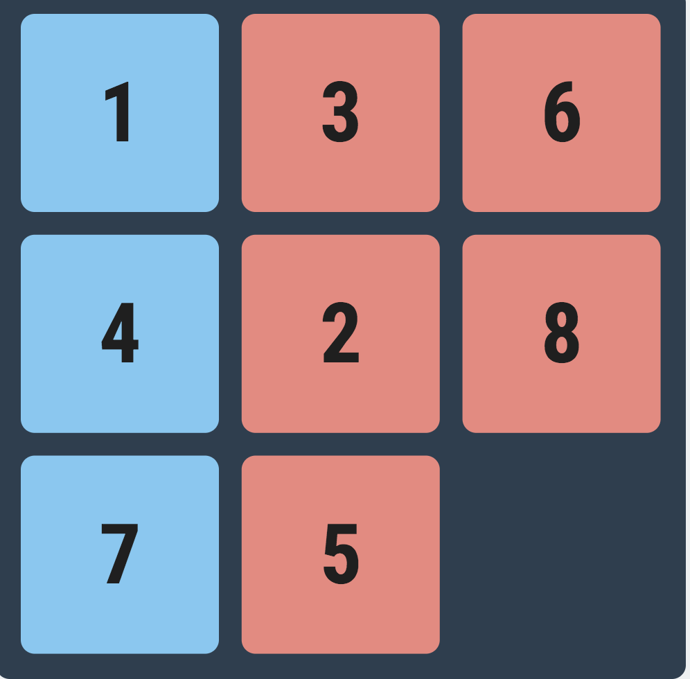

# 8 Puzzle

8 puzzle game implemented with vanilla JavaScript.

## Features

### Moving the tiles
<br>
When the tile is in the right position, the background color is blue. Otherwise, its background color is red.


<br>
### Shuffle
<br>
 The shuffle function will perform 20 random moves.
 ```javascript
 function shuffle() {
   clearTimers(solveTimeouts);
   var boardTiles = document.querySelectorAll('.tile');
   var shuffleDelay = 200;
   shuffleLoop();

   var shuffleCounter = 0;
   while (shuffleCounter < 20) {
     shuffleDelay += 200;
     shuffleTimeouts.push(setTimeout(shuffleLoop, shuffleDelay));
     shuffleCounter++;
   }
 }
 ```
 ### Solve
 The solve function will solve the puzzle naively. I would optimize it with algorithms
 ```javascript
 function solve() {
   clearTimers(shuffleTimeouts);


   repeater = history.length;

   for (var i = 0; i < repeater; i++) {
     console.log("started");
     solveTimeouts.push(setTimeout(moveTile, i*100, tiles[history.pop()-1], false));
   }
 }
 ```
